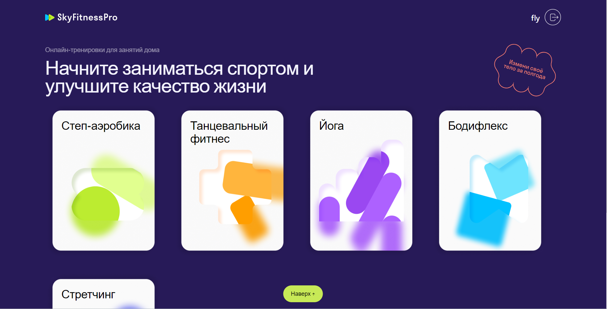
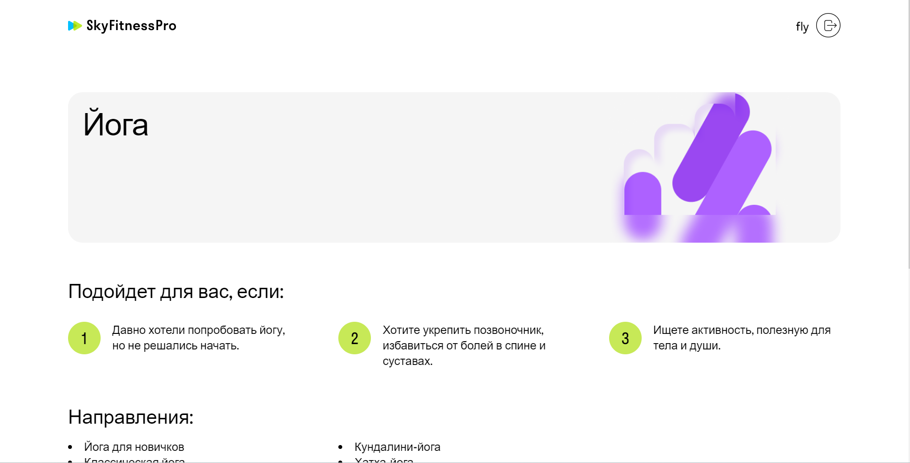
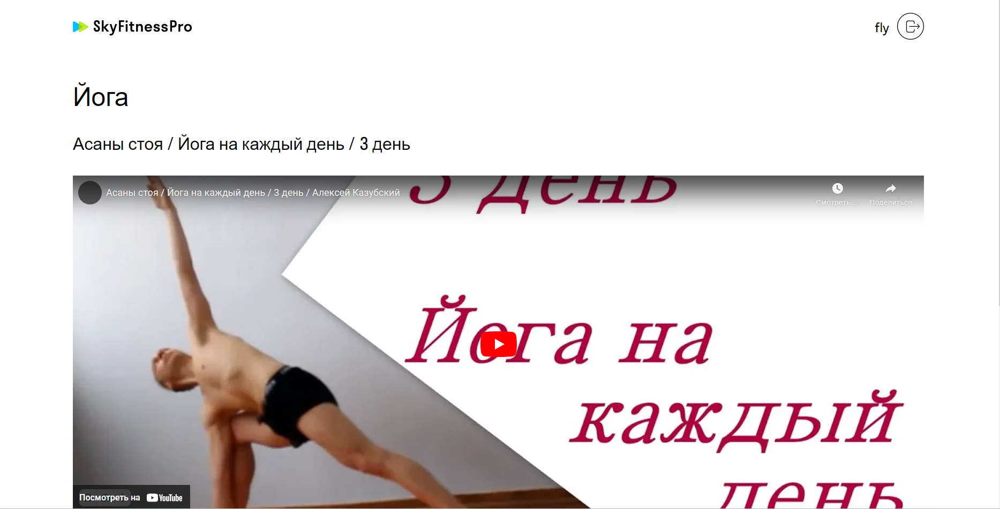

# fitness-app
Командный проект от skypro. Приложение для занятий фитнесом.
Основные функции:
- Авторизация
- Возможность добавить курс в профиль
- Просмотр видео
- Заполнение прогресса по тренировкам
- Смена пароля пользователя

&nbsp;
&nbsp;
&nbsp;

## Используемые технологии

  &nbsp;
  &nbsp;  
  &nbsp;

## Ссылка на готовый проект
https://resplendent-frangipane-1f3b0e.netlify.app
